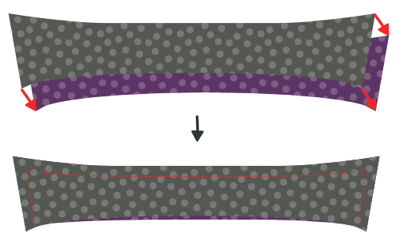
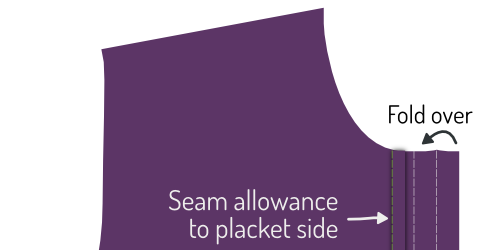
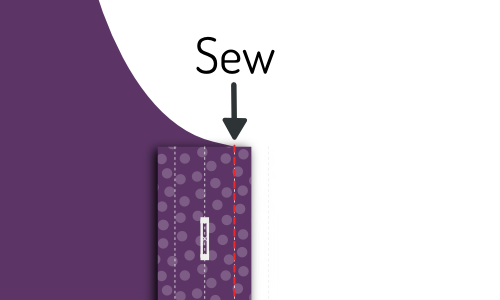
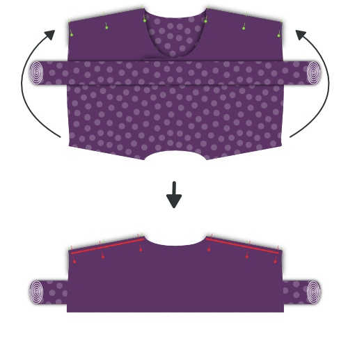
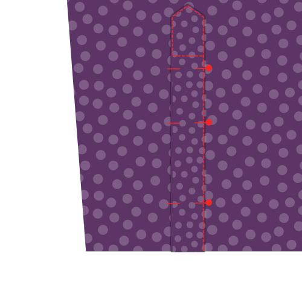
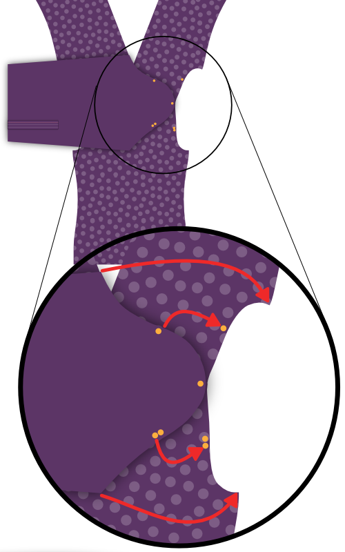
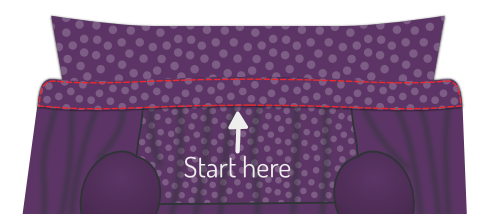

## Ce dont vous avez besoin

Pour réaliser Simon, vous aurez besoin de ce qui suit :

 - Environ 2 mètres d'un tissu approprié (voir les [Options de tissu](#options-de-tissu)
 - Boutons
 - Entoilage thermocollant pour le col et les poignets (et possiblement sur la patte de boutonnage avant)

## Options de tissu

N'importe quelle boutique de tissu qui en vaut la peine devrait posséder une section pour chemise.
Vous pouvez juste entrer, demander où elle se trouve, et choisir quelque chose qui vous plait.

La plupart des tissus que vous trouverez là seront faits de coton, ou un mélange de coton.
Mais vous êtes tout à fait libre d'opter pour une autre fibre.

Lorsque vous achetez en ligne, cela peut être plus compliqué de se faire une bonne idée de ce que vous êtes en train de regarder.
En l'absence de toucher, il est bon de savoir une chose ou deux sur les différents types de tissage.
Le tissage est comment le tissu est tissé, et cela détermine non seulement l'aspect du tissu, mais aussi comment vous vous sentirez dedans ainsi que son drapé.

> Sans vouloir commencer une encyclopédie sur les tissus ici, voici quelques termes que vous pourrez rencontrer en cherchant du tissu sur internet.
>
> **Toile à Drap ou popeline**
>
> La popeline est à choisir pour cette chemise blanche que vous porteriez pour un entretien de travail ou un mariage.
>
> La toile à draps (ou popeline) est réalisée par tissage simple qui résulte en un tissu simple et plat qui va vous donner un aspect net et formel.
>
> C'est généralement un tissu léger, qui, s'il est de couleur clair, aura tendance à être légèrement transparent.
>
>
> **Twill**
>
> Vous pouvez reconnaître du tissu twill par leur texture caractéristique en diagonale due au tissage.
>
> Il drape plus facilement que la popeline, se froisse moins et lorsqu'il le fait, est plus facile à repasser.
>
> Le revers de la médaille est qu'il ne vous donnera pas cette vibration nette et amidonnée que peut vous donner la popeline.
>
>
> **Point de sellier**
>
> Le point de sellier est le cheval de trait de la fabrication de chemise. Généralement, les cotons point de sellier sont plus lourds, plus épais et durables.
>
> Le point de sellier a un aspect moins formel que la popeline ou le twill, mais plus formel que de l'oxford. Ceci, combiné avec sa durabilité, en fait un très bon choix pour la chemise quotidienne de travail.
>
>
> **Chambray**
>
> Le chambray est réalisé par tissage simple, comme la popeline. Il est différent car il utilise un fil plus lourd, et généralement des couleurs différentes pour la chaîne et la trame.
>
> Le résultat est un tissu bien plus texturé, autant au toucher qu'en apparence lorsque différentes couleurs créent un tissu chiné.
>
>
> **Denim**
>
> Le denim n'a pas besoin d'introduction. C'est la matière dans laquelle est faite vos jeans.
>
> Techniquement un tissu denim twill (cherchez la texture signature avec les diagonales) est produit en grammage moins élevé que celui qui caractérise celui dont est fait votre jean. Ce sont ceux qui sont employés pour les chemises.
>
>
> **Flanelle**
>
> Depuis Curt Cobain aux hipsters de votre coffee shop local, ils portent tous des chemises en flannelle.
>
> Plus chaude que toutes les options montrées ici, la flannelle vient généralement en coton brossé bien que vous pouvez en trouver avec de la laine ajoutée pour de la chaleur supplémentaire.
>
>
> **Lin**
>
> Le lin se froisse pour un rien, mais vous ne pouvez pas trouver mieux pour un look safari.
>
> La raison pour laquelle vous l'associez avec des aventures en climats tropicaux est que le lin respire comme aucune autre fibre et vous gardera le plus au frais.
>
>
> **Nombre de fils**
>
> Un nombre de fils plus élevé signifie un tissu plus doux (et plus cher aussi).
>
> Le nombre de fil est exprimé en nombres, comme 60s, 80s, 100s et ainsi de suite jusqu'à 300s et plus.
>
> Il y a un inconvénient cependant. Les nombres au dessus de 100s sont typiquement fait en torsadant deux fils ensemble. Comme du nombre de fil 160s signifie que deux fils 80s ont été torsadés ensemble pour ce fil.
>
>
> **Célibataire ou retors simple**
>
> Si un fil est fait de 2 fils (voir le nombre de fils ci-dessus) nous appelons ça un fil en retors simple.
>
> Si le fil est fait d'un unique fil, il est appelé célibataire.
>
> Vous pouvez espérer d'un fil retordu d'être plus durable, et plus cher.

## Découpe

 - **Tissu principal**
   - Coupez **1 devant gauche**
   - Coupez **1 patte de boutonnage** (seulement si vous avez opté pour une patte de boutonnage séparée)
   - Coupez **1 devant droit**
   - Coupez **1 patte de boutonnière ** (seulement si vous avez opté pour une patte de boutonnière séparée)
   - Coupez **1 dos**
   - Coupez **1 col**
   - Coupez **1 dessous de col**
   - Coupez **2 empiècements** or **4 empiècements** si vous avez choisi un empiècement séparé
   - Coupez **2 manches**
   - Coupez **2 pied de col**
   - Coupez **2 pattes de boutonnage de manche du dessous**
   - Coupez **2 pattes de boutonnage de manche du dessus**
   - Coupez **4 poignets**
 - **Entoilage thermocollant**
   - Coupez **1 col**
   - Coupez **1 dessous de col**
   - Coupez **2 pieds de col**
   - Coupez **2 poignets**

> Lorsque vous coupez deux mêmes pièces, vous pouvez les couper [endroit contre endroit](/fr/docs/sewing/good-sides-together).
> Cependant, lorsque je travaille avec du tissu avec un motif, Je préfère les couper individuellement pour contrôler finement le raccord de motif.
>
> Lorsque vous les coupez individuellement, souvenez-vous qu'elles doivent être l'image miroir l'une de l'autre. Alors retournez soit votre patron soit votre tissu lorsque vous coupez la deuxième pièce.

### Avertissements
 - Les **devant droit**, le **devant gauche**, et les **manches** ont des coutures qui doivent être rabattues. Ces pièces ont donc une marge de couture supplémentaire pour permettre ce type de couture. Lorsque vous coupez ces pièces, vous **devez** inclure cette marge de couture supplémentaire.
 - La garde du poignet et la patte de boutonnage de poignet n'ont pas de marge de couture. C'est normal, coupez les juste comme elles sont dessinées sur le patron.
 - Ne coupez pas les pinces dans l'empiècement **dos**. Vous devez les marquer, mais pas les couper.

Simon est un patron très polyvalent, alors votre ébauche va peut-être différer de l'exemple de mise en page ci-dessous :

> La [légende des notations](/fr/docs/patterns/notation) explique la signification de tous les différents marquages et lignes sur votre ébauche.

## Construction

### Etape 1 : Thermocoller l'entoilage

#### Repasser l'entoilage sur les poignets
Pour réaliser deux poignets, vous devez couper votre pièce poignet en quatre dans le tissu, et deux fois dans l'entoilage.

Pour chaque poignet, repassez la pièce d'entoilage sur l'envers de la pièce poignet.

> Si l'intérieur et l'extérieur de votre poignet sont dans le même tissu, laquelle des pièces poignets porte l'entoilage importe peu.
>
> Cependant, un détail populaire de style est d'avoir un tissu différent à l'intérieur du poignet. Dans ce cas, assurez-vous de fixer le thermocollant sur la pièce poignet qui sera à l'extérieur.

> Selon le poignet que vous aurez choisi, sa forme va être différente.
>
> Dans la première illustration, vous pouvez voir à la fois un poignet rond et un poignet français comme exemples.
>
> A partir d'ici, le poignet rond sera utilisé dans les illustrations, mais le procédé est le même pour les autres types de poignet.

#### Fixer le thermocollant au col, dessous de col et pied de col
Pour réaliser votre col, vous devez couper un dessous de col, un col, et deux pieds de col. Cela, à la fois dans le tissu et l'entoilage.

Pour chaque pièce, fixez au fer l'entoilage sur l'envers du tissu.

### Etape 2 : Préparer les poignets

#### Coudre les poignets

Placez les deux parties de votre poignet (l'une avec l'entoilage, l'autre sans) endroit contre endroit, et les piquez ensemble à la marge de couture standard.

> **Assurez-vous de**
>
> - Ne pas coudre la partie qui sera assemblée à la manche plus tard
> - Vous arrêter à la distance de marge de couture depuis le bord du côté de la manche

#### Découper le surplus de couture

Avant de retourner votre poignet, nous devons découper l'excès de marge de couture pour réduire l'épaisseur.

#### Repasser la marge de couture

Rabattre la marge de couture du ucôté de la manche, et repassez la.

> Si vous avez cousu trop loin sur le bord plus tôt, vous aurez à défaire quelques points.

#### Retourner le poignet et repasser

Retournez le poignet à l'endroit, et donnez lui un bon coup de fer.

> Lorsque vous repassez vos poignets, assurez-vous de rouler la couture un peu vers l'arrière du poignet pour garantir que le tissu de l'intérieur du poignet ne sera pas visible.

Vous pouvez mettre les poignets de côté, nous les fixerons plus tard.

### Etape 3 : Préparer le col

#### Coudre le col et le dessous de col ensemble

Placez les deux parties du col ensemble endroit contre endroit, et les assemblez-les avec la marge de couture standard.

#### Découper le surplus de couture

Avant de retourner votre col, nous devons découper l'excès de marge de couture et dégarnir les pointes pour réduire l'épaisseur.

#### Retourner le col et repasser

Retournez le col à l'endroit, rendez les extrémités aussi pointues que possible, et donnez-y un bon coup de fer.

> Lorsque vous repassez le col, souvenez-vous que le dessous de col est un peu plus étroit.
>
> Lorsque vous alignez les côtés non cousus, cela fera que la couture va rouler vers l'arrière du col pour garantir que le tissu du dessous de col ne sera pas visible.

#### Surpiquer le col

Surpiquez le long du bord du col. Cela va bloquer la marge de couture et donner un aspect net au col.

> La distance à laquelle vous allez surpiquer à partir du bord est un choix de style. C'est souvent un peu moins que la marge de couture standard. Jetez un coup d'oeil à des chemises existantes pour vous faire une idée.

### Etape 4 : Assembler le col et le pied de col

#### Placer le col entre les pieds de col et bâtir en place

Marquer le milieu de votre col et de votre pied de col avec une épingle. Les milieux de chaque pied de col sont en vérité décalés étant donné qu'une extrémité est plus longue que l'autre. A la place, trouvez le milieu entre les deux crans.

Tout d'abord, placez un pied de col à l'endroit, puis votre col et dessous de col à l'endroit (et le côté non cousu sur le haut), et finalement le deuxième pied de col à l'envers.

Votre col devrait se trouver au milieu des deux pieds de col, et les milieux (là où vous avez placé votre épingle) devraient être alignés.

> La manière dont les choses vont se présenter va dépendre un peu de votre choix de col, mais en général votre col va pencher vers le bas, et votre pied de col vers le haut.
>
> Pour aligner tout cela, nous allons les bâtir ensemble, plutôt que les épingler. Votre col est une partie importante de votre chemise, alors il vaut la peine d'être bâti.

Tout d'abord, remplacez les marquages d'épingle du milieu avec une épingle qui épingle toutes les parties ensemble.

Ensuite, commencez à bâtir depuis cette épingle jusqu'au coin du col, en vous assurant d'aligner les deux bords du tissu.

Lorsque vous atteignez le coin de votre col, continuer à bâtir et bâtissez la fin des deux pieds de col ensemble.

Lorsque vous aurez fait un côté, recommencez depuis votre épingle du milieu et faites l'autre côté. Quand vous aurez terminé de bâtir, vous pourrez retirer l'épingle.

#### Coudre le col au pieds de col

Cousez le long du bord de votre pied de col, en respectant une marge de couture standard.

> Assurez-vous de vous arrêter 2 cm avant la bordure (soit deux fois la marge de couture standard) comme nous allons plier la marge de couture dans la prochaine étape, et nous avons besoin de laisser les pieds de col assez séparés pour glisser la chemise entre eux plus tard.

#### Rabattre et repasser la marge de couture du pied de col

Rabattez la marge de couture de votre pied de col sur le côté non cousu et repassez-la.

> Dans la partie centrale, repassez la marge de couture sera facile. Mais à l'approche des pointes de votre col, le faire va être délicat sans faire de pli sur votre col.
>
> Repasser au mieux que vous pouvez sans créer de pli sur votre col. Nous repasserons de nouveau après avoir retourné le col.

#### Retourner le pied de col et repasser

Retournez le pied de col à l'endroit, et donnez-lui un bon coup de fer. Veillez à garder la marge de couture sur le pied de col pliée vers l'intérieur.

Vous pouvez maintenant mettre de côté votre col, nous l'assemblerons plus tard.

### Etape 5 : Optionnelle : Coudre votre étiquette

Notre prochaine étape est d'attacher l'empiècement. Mais l'empiècement est l'endroit idéal pour y mettre une étiquette. Alors si vous voudriez faire cela, nous devrions commencer par là.

Prenez un empiècement, et vous pouvez coudre une étiquette dessus au centre (sur l'endroit).

### Etape 6 : Assembler les empiècements au dos

Placez un empiècement à l'endroit. Par dessusn, placez votre dos à l'endroit, en alignant la couture où il sera attaché à l'empiècement.

Enfin, placez votre second empiècement par dessus le dos, mais à l'envers.

Votre dos devrait maintenant être pris en sandwich entre les faces endroits de vos deux empiècements.

Si c'est le cas, cousez les en place le long de la ligne dos/empiècement, en veillant à respecter la marge de couture.

> If you added a label in step 1, make sure to put the yoke with your label at the bad side of your back.

When you're done, don't forget to give it a good press to make the seam lie flat.

### Step 7: Edge-stitch the yoke
  

With your yokes attached to the back, we are going to edge-stitch along the seam we just made, on the yoke side.

> Fold the inner yoke out of the way. Our edge stitching will catch outer yoke, back and all the seam allowances, but not the inner yoke.

Just sew right next to the seam joining the outer yoke to the back.

> Edge-stitching is like top-stitching, but right next to the seam

### Step 8: Close the back darts

> Depending on your measurements, your pattern might not have back darts at all. In that case, proceed to the next step.

Your pattern may or may not have back darts. If it has them, you should close them now.

Place your back down with the good side up, and fold it back from the side seam so the fold runs from the top to the bottom of your dart.

Do the same for the other dart, so that both sides are folded back.

Feel free to gently press in this crease, it will help you to neatly sew the darts.

Sew across the line marking the dart to close the darts. Be careful to make sure the top and bottom of your darts are precisely where they need to be. If one dart sits higher than the other, it will look bad.

When you're done, don't forget to give it a good press. Press the extra fabric of the dart towards the side seams.

### Step 9: Prepare the button placket

> If you have chosen a grown-on placket, you can skip the first two sub-steps and skip ahead to [Fold the button placket](#fold-the-button-placket).

#### Sew on the button placket

If you have chosen a separate button placket, sew it to the Front Right piece.

Place the Front Right (piece 1) down with the good side up, and place the Button Placket (piece 1b) on top of it with the good side down, making sure to align the seam.

Sew it in place with the default seam allowance.

#### Press seam allowance to placket side
Place your front with the good side down, and press the seam allowance to the button placket side.

#### Fold the button placket

Now, fold over the button placket on the first fold line, and press this fold in place.

Then, fold the placket over again, making sure to have the fabric extend just beyond the seam that joins your placket to the front.

When you're happy, press the folded placket.

#### Sew down the folded placket

> This is the classic approach. If you have chosen the seamless Button placket style, you don't have to do this.
>
> Rather than sew the placket down, simply leave it folded. The folds will be secured in place when we attach the buttons later.

From the good side of your shirt, sew down the folded placket by stitching in the ditch.

To do so, sew exactly on top of your earlier seam. Since you folded the fabric of your placket a bit passed this seam, it will get caught at the back, fixing your folded placket in place, and locking the seam allowance inside.

### Step 10: Prepare the buttonhole placket

> If you have chosen a grown-on placket, you can skip the first two sub-steps and skip ahead to Understanding a classic buttonhole placket.

#### Sew on the buttonhole placket

If you have chosen a separate buttonhole placket, sew it to the Front Left piece.

Place the Front Left (piece 2) down with the good side up, and place the Buttonhole Placket (piece 2b) on top of it with the good side down, making sure to align the seam.

Sew it in place with the default seam allowance.

When you're done, don't forget to give it a good press. Press the seam allowance towards the placket side.

#### Press seam allowance to the placket side
Place your front with the good side down, and press the seam allowance to the buttonhole placket side.

#### Understanding a classic buttonhole placket

> If you have chosen a seamless placket, you should follow the steps of the button placket, as the construction is identical.
>
> The steps below are for a classic buttonhole placket.

Your placket has a bunch of lines on it, so let's first clarify what they are:

 - The buttonhole line has long dashes with buttonholes on it. It marks where the buttonholes should go
 - The two fold lines have long dashes and sit at an equal distance right and left of the buttonhole line
 - The two+two sew lines are dotted lines that sit at an equal distance of each fold line

#### Trim back seam allowance

> If you have chosen a grown-on placket, this does not apply.

The seam allowance of where you sewed your buttonhole placket to your front should fit inside your folded placket.

For that, trim back the seam allowance so that it doesn't extend beyond the first fold line on the placket.

#### Fold the buttonhole placket

Fold the placket on the first fold line. Press the fold in place.

Then, fold the part you just folded again, this time on the second fold line. Press this fold in place too.

> When your placket is folded and pressed, place a few pins along the length of your placket to keep things from shifting around

#### Sew the buttonhole placket

Sew on the first sew line, closest to the edge.

Then, flip your shirt over so that the good side is up, and your placket is up too. Then sew on the second sew line.

> These two lines of top-stitching will always be visible, so make sure to keep it neat

#### Press the buttonhole placket

Congratulations, you made a classic buttonhole placket.

Now press that baby. You know you want to.

### Step 11: Close the shoulder seams

> **Let's stuff a burrito**
>
> We are going to close the shoulder seams with a technique that is commonly know as the **burrito method**.
>
> If you are familiar with the burrito method, you already know what to do. If not, read on for a clever way to neatly close your shirt's shoulder seams while locking all the unfinished edges out of sight.

#### Pin the fronts to the outside yoke

Place your back down with the good side up, but be careful to fold the inner yoke downward (as illustrated by the dotted line.

Place your fronts on your back, with the good sides down. Pin fronts to the yoke at the shoulder seam, good sides together.

#### Roll, roll, roll your shirt, pin down and sew your seam

Roll up your back and fronts starting at the hem. Roll them into a neat sausage upwards until you can see the entire turned down yoke.

Now, you can flip the inner yoke over your rolled sausage to align the shoulder seams with the other yoke and fronts.

Pin them in place, and then sew the shoulder seams, making sure to keep your sausage (or burrito stuffing) out of the way so it doesn't get caught in the seam.

> Made sure to align the actual seam line.
> Due to the uneven angles at the neck opening, the fabric edge is often longer on one side than on the other.
>
> However, the seamlines are the same lenght, so make sure to match them carfully using the notches.

#### Flip it inside out through the neck opening
When you've sewn both shoulder seams, reach in through the neck opening, and pull out the back and front parts to inside-out your burrito.

#### Press the shoulder seams

You did all this work, so now make sure you make it look super sharp by giving it a good press. Make sure that the seam allowance between your yokes lies nice and flat for that.

### Step 12: Edge-stitch the shoulder seams of the yoke

Just as we've edge-stitched the bottom seam of the yoke in Step 3, we're going to edge-stitch the yoke at the shoulder seams too.

Since you've just pressed these shoulder seams, everything should lie nice and flat, and you just need to run a stitch right next to the seam.

> Make sure to edge-stitch on the yoke part, where you will catch all the seam allowance, and not on the front part.

### Step 13: Construct the sleeve placket

#### Sew in the cuff guard

 - Place your sleeve with the good side down, and your cuff guard on top, also with the good side down.
 - Align the edge of your cuff guard (aka sleeve placket underlap) with the cut in your sleeve, on the side shortest to the side seam.
 - Now sew along the fold line marked on the cuff guard, closest to the edge.

> If during cutting out your pattern pieces you had not cut into your sleeve on the line where the sleeve placket needs to be put in, you need to do that first.

 - Fold over the cuff guard, and press down this seam.
 - Turn your sleeve over with the good side up, and bring your cuff guard through the slit in your sleeve.
 - Fold it twice on the lines so that the unfinished seam is tucked inwards.
 - Make your folds so that the upper folds sits ever so slightly further than the seam you already made.
 - Press everything down, and then edge-stitch the cuff guard in place.

#### Fold and press the placket

Origami time! We're going to fold the sleeve placket overlap using the marked fold lines as our guide. This will be a lot easier if you press between each fold.

 - First, fold the outer edges of the placket inwards.
 - Next, fold the entire thing double.
 - Then, fold down both tips into a nice pointy shape.
 - Now give it a final good press.

@[youtube](kgd5eubxShM)

> Here's [a very short YouTube video of me folding the placket](https://www.youtube.com/watch?v=kgd5eubxShM).

#### Pin placket in place

Place your sleeve down with the good side up. The guard we have sewn in earlier sits against the other unfinished fabric edge of where you cut into your sleeve.

Place your placket around that edge, one side above it, one underneath.

You need to slide the placket onto your sleeve until the middle of it (the tip) aligns with the cut in your sleeve.

The idea is that the placket closes up the unfinished edge, but also covers the guard of the other edge.

When you've got it where you want it, pin the placket down.

#### Sew the sleeve placket

Start at the edge of the sleeve (the bottom of the sleeve placket) and edge-stitch along the edge upwards.

Go around the tip, and come down again on the other side (the fold side) until you have passed the point where your guard ends.

Then, sew horizontal to the other side of the placket to finish.

> I have included an extra illustration here that only shows the outline of the placket. You can see that the end of the guard is caught in our stitching of the placket, and is thus neatly tucked away.

### Step 14: Set in sleeves

#### Remember, this is a flat-felled seam

> **Careful with the extra seam allowance for the flat-felled seam**
> There is extra seam allowance on the sleeve to allow for the creation of the flat-felled seam.
>
> As such, be careful to not align the fabric edge, but align the seam so that the sleeve sits out 1cm.

#### Pin shirt in place

Spread your shirt open so that both fronts and back lie flat with their good sides up.

Now place your sleeve on top with the good side down, matching the notch at the top of the sleeve with the shoulder seam.

> Be careful, your sleeve is not symmetric, so be sure to have the double notch (and cuff guard) on the back side, and the single notch on the front side.
>
> Also note that the double notches on the back of your sleeve do not have corresponding notches on the back. That's because it should match op with the seam where your yoke joins the back.

You now need to pin the sleeve to the armhole. To do so, make sure to:

 - Match the start and end of the sleevehead to the start and end of the armhole
 - Match the notches on the sleevehead to the notches on the back and fronts
 - Distribute the sleevecap ease between the notches as shown

#### Distribute sleavecap ease

The default sleevecap ease for this pattern is 0.5cm. If you have sleevecap ease, you need to distribute that extra length evenly between the notches as shown.

> If you are unsure what sleevecap ease is, have a look at the [documentation for the sleevecap ease pattern option](/en/docs/patterns/simon/options#sleevecapEase).
>

#### Sew sleeve in armhole
When you've got your sleeve neatly pinned in your armhole, sew it in place. Be careful to avoid any pleats in the part between the notches where you need to ease in the sleevecap ease.

> Needless to say, but I'll say it anyway: Repeat this step for the other sleeve.

### Step 15: Flat-fell armhole seam

#### Press seam allowance to one side

Lay down your freshly sewn sleeve seam with the good side down

We are going to press the seam allowance to one side. To do so, identify the seam allowance that is wider (for the flat-felled seam).

The longer seam allowance needs to lie on top of the shorter (standard seam allowance).

Once you have verified that, press down the seam allowance.

#### Fold under extra seam allowance

Now, fold the extra seam allowance for the flat-felled seam under the standard seam allowance.

You can use pins to hold this in place, but it's simpler to just press it.

> This will be relatively easy on the straight parts of the seam, but a bit more tricky at the curved sections. Take your time, and if needed you can cut into the extra seam allowance to allow it to flare open, or bend.

#### Sew the flat-felled seam
Now, from the bad side of the fabric, sew the seam allowance down just at the edge where it folds under the other seam allowance.

Important here it to keep an even distance from the seam of your sleeve. If you have a felling foot for your sewing machine, it will help you with that. But if not, just be careful.

> It is more important to keep and even distance from the sleeve seam than to sew exactly at the edge of the fold. Ideally, the fold sits at an even distance anyhow, but if it doesn't, just make sure to sew parallel to the sleeve seam. Even if that means you deviate a bit from the folded edge.

#### Press the flat-felled seam
When it's all done, press the flat-felled seam from the good side so it lies nice and flat.

### Step 16: Close the side/sleeve seams

Place your shirt with the good sides together, and sew the side and sleeve seams to close the shirt.

> There is extra seam allowance on the sleeve and front sides to allow for the creation of the flat-felled seam.
> As such, be careful to not align the fabric edge, but align the seam so that the extra seam allowance sits out 1cm.

### Step 17: Flat-fell the side/sleeve seams

#### Press seam allowance to one side

We are going to press the seam allowance to one side. To do so, identify the seam allowance that is wider (for the flat-felled seam).

The longer seam allowance needs to lie on top of the shorter (standard seam allowance).

Once you have verified that, press down the seam allowance.

#### Fold under extra seam allowance

Now, fold the extra seam allowance for the flat-felled seam under the standard seam allowance.

You can use pins to hold this in place, but it's simpler to just press it.

> This will be relatively easy on the straight parts of the seam, but a bit more tricky at the curved sections. 
> Take your time, and if needed you can cut into the extra seam allowance to allow it to flare open, or bend.

#### Sew the flat-felled seam
Now, from the bad side of the fabric, sew the seam allowance down just at the edge where it folds under the other seam allowance.

Important here it to keep an even distance from the seam of your sleeve. If you have a felling foot for your sewing machine, it will help you with that. But if not, just be careful.

> It is more important to keep and even distance from the sleeve seam than to sew exactly at the edge of the fold. Ideally, the fold sits at an even distance anyhow, but if it doesn't, just make sure to sew parallel to the sleeve seam. Even if that means you deviate a bit from the folded edge.

#### Press the flat-felled seam
When it's all done, press the flat-felled seam from the good side so it lies nice and flat.

### Step 18: Attach cuffs to sleeves

#### Pin cuff in place

You need to insert the sleeve between the two layers of your cuff, making sure that that good side of the fabric sits against the side of your cuff that has the interfacing applied to it.

You will need to pin this in place, because depending on how long your sleeve placket is, it might be hard or even impossible to get this to lie flat.

Also note that your sleeve edge will be longer than your cuff (how much longer depends on the sleeve drape). You need to make one or a few folds in your sleeve to accommodate for this.

> Your pattern contains helplines on the sleeve to help you place to folds.

> Take your time to pin everything carefully in place. We are going to edge-stitch this later, so it's important that front and back of your cuff align nicely.

#### Edge-stitch cuffs to sleeves

Once everything is pinned in place, edge stitch along the edge of your cuff to attach it to your sleeve.

It's important to catch both outer and inner layer of your cuff on the edge.

> Make sure to edge-stitch from the outer layer side (the good side of your sleeve) and keep it parallel with your cuff edge.

When you're done, give your cuffs a good press.

#### Top-stitch the cuffs

> Make sure to press your cuffs before you do this.

Top-stitch around your cuff at a distance from the edge that is a bit less than your seam allowance. Go all the way around your cuff.

### Step 19: Attach the collar

#### Baste collar in place

This is an important seam, so we are going to baste this in place to make sure it sits exactly right before we sew it.

Start at the center back, and place the seam allowance of your back part between your two collar stands. Work your way around one side, and then do the other.

Make sure to respect the standard seam allowance and - important - avoid any wrinkles.

> While your collar stand is relatively straight, we are going to sew it to what is essentially a hole in your shirt.
>
> That's a bit tricky, so take extra care at those parts that are most curved: where the back joins the fronts.

#### Edge-stitch collar in place

When you're happy with how you've basted your collar in place, it's time to sew that thing down.

We're going to start at center-back and sew all the way around the collar stand.

#### Sew along the collar edge

To give more body to your collar, and firmly secure it in place we're going to sew along the top edge of the collar stand.

Sew about half the seam allowance from your earlier edge-stitching. Make sure to stop a few cm before the end of the collar.

> You need to stop a few cm before the end of the collar (note: the end of the collar, not the end of the collar stand) so that this seam is entirely covered when the collar is folded down.

#### Press the collar

Now that your collar is attached, give it a good press.

### Step 20: Hem your shirt

Time to finish the hem (that's the part you tuck in your trousers).

Fold up half of the hem allowance and press down. Then, fold up again and press again.

Now, sew along upper edge to finish the hem.

### Step 21: Create buttonholes

If you haven't done so initially, mark all the places you should have buttonholes.

They sit along the front closure and at your cuffs.

When you've marked them, make buttonholes there.

### Step 22: Attach buttons

Pin your shirt closed to transfer the place of the buttonholes to the button sides.

When you've marked where buttons should go, sew them on.

> Rather than mark the location of the buttons from the pattern, I prefer to transfer the location of the created buttonholes.
>
> This way, if a buttonhole sits a little bit out of place, the button will simply follow it.

