## Vidéo
Le texte est un peu sec pour vous ? J'essaie de réaliser des vidéos disponibles comme parties intégrantes de la documentation des patrons.

Dans ce cas particulier, il y a beaucoup de matériel vidéo disponible, mais il a été originellement enregistré pour une version précédente du patron. Ce sont tout de même de bonnes vidéos.

@[youtube](https://www.youtube.com/embed/videoseries?list=PL1gv5yv3DoZOcmOJf6f0YWi522VXXv-mM)

## Ce dont vous avez besoin

Pour réaliser Theodore, vous aurez besoin de ce qui suit :

 - Fournitures de base pour la couture
 - Environ 2 mètres d'un tissu approprié ([voir les Options de tissu](#options-de-tissu))
 - Environ un mètre de tissu de doublure
 - Entoilage thermocollant pour les poches arrières et la ceinture
 - une fermeture éclair, un bouton et une agrafe pour la braguette

## Options de tissu

Vous avez beaucoup d'options ici, mais gardez à l'esprit que c'est un pantalon de coupe classique. En d'autres termes, n'utilisez pas de tissu élastique, du denim, ou du simili cuir ou ce genre de choses. Des choix peu risqués sont la laine, le coton, ou du lin, possiblement mélangés avec des fibres synthétiques.

Pour la **laine**, regardez dans la section pour costume de votre boutique de tissus. Si c'est votre premier, un mélange polyester/laine va probablement être plus indulgent avec votre portefeuille. Mais ne laissez pas uniquement le prix vous guider, acheter un tissu bon marché fantaisiste est la meilleure façon d'obtenir un pantalon à l'aspect douteux, et être frustré dans le procédé.

Pour le **coton**, optez pour un grammage plus élevé. Le coton peut également être un peu facile pour le débutant que la laine. Si vous n'êtes pas sûr, demander du chino dans la boutique de tissu et choisissez simplement une couleur qui vous plait.

Rien ne surpasse le **lin** un jour de grande chaleur. C'est amusant à travailler aussi, mais il se froisse pour un rien, et même les pantalons réalisés avec la plus grande rigueur ont un aspect quelque peu brouillon lorsqu'ils sont fait en lin. Ce que je veux dire, ce n'est peut-être pas le bon choix pour votre premier pantalon.

## Découpe

 - **Tissu principal**
   - Coupez **2 derrières** endroit contre endroit
   - Coupez **2 devants** endroit contre endroit
   - Coupez **1 ceinture droite**
   - Coupez **1 ceinture gauche**
   - Coupez **2 braguettes** endroit contre endroit
   - Coupez **2 empiècements côté** endroit contre endroit
   - Coupez **4 empiècements poche arrière** 
   - Coupez **8 passants de ceinture** 
 - **Doublure**
   - Coupez **2 doublures devant** endroit contre endroit
   - Coupez **1 doublure ceinture gauche**
   - Coupez **1 doublure ceinture droite**
   - Coupez **1 parement de braguette**
   - Coupez **4 fonds de poche devant** 2x2 endroit contre endroit (**voir les avertissements plus bas**)
   - Coupez **2 fonds de poche arrière interne** 
   - Coupez **2 fonds de poche arrière externe** 
 - **Entoilage**
   - Coupez **1 entoilage ceinture gauche**
   - Coupez **1 entoilage ceinture droite**
   - Coupez **4 entoilage poche arrière**

### Avertissements
 - La **doublure devant** est coupée à partir de la partie **devant** de votre ébauche, vers le bas jusqu'à la ligne juste en dessous du genou
 - Prêtez de l'attention à la ligne de droit-fil sur les **empiècements braguette**, **parement de braguette**,  **empiècement côté**
 - Il y a deux variations du fond de poche avant. Vous devez en couper deux de chaque :
    - Coupez deux pièces complètes
    - Coupez deux pièces s'étendant seulement jusqu'à la ligne en pointillés sur la gauche
 - Le **fond de poche arrière interne** et le **fond de poche arrière externe** sont très similaires. Veillez à les marquer correctement de façon à pouvoir les distinguer.

Ci-dessous une disposition typique d'une ébauche de Theodore :

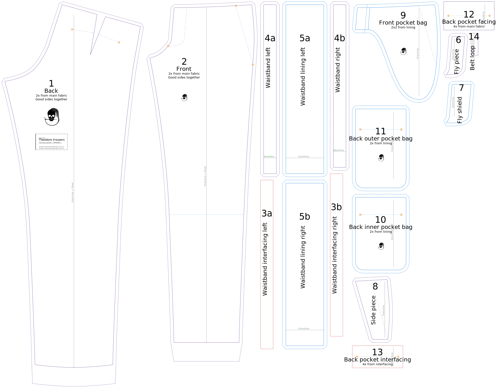

> La [légende des notations](/fr/docs/patterns/notation) explique la signification de tous les différents marquages et les lignes de votre ébauche.

## Construction

> Beaucoup des étapes ci-dessous doivent être répétées pour les deux jambes. 
>
> Ce n'est pas toujours mentionné parce que la vie est courte et écrire continuellement "N'oubliez pas de faire ceci pour les deux jambes" fatigue très rapidement.

### Etape 1 : Bâtir les lignes de plis

La première chose à faire est de bâtir la ligne de pli des jambes de votre pantalon. Faites le sur les parties devant et derrière de chaque jambe.

### Etape 2 : Fermer les pinces arrières et repasser

### Fermer les pinces arrières

Pliez la pièce 1 (derrière) en deux pour que les crans de la pince sur la ceinture soient alignés, et qu'un pli net aille du cran jusqu'à la fin de la pince. N'hésitez pas à repasser brièvement le pli, cela rendra la couture de la pince plus aisée à effectuer précisément.

Fermez la pince en cousant depuis la ceinture jusqu'à la fin de la pince.

Utiliser un point de faible longueur, et continuez de piquer après la fin de la pince, puis faites un point arrière dans la marge de couture.

#### Couchez les pinces vers les côtés au fer

Aplatir au fer les pinces arrières, en pliant la marge de couture vers les côtés de votre pantalon.

### Etape 3 : Construire les poches arrières

Construire les poches passepoilées doubles à l'arrière de votre pantalon, en incluant le fond de poche.

> **Poche passepoilée double**
>
> Construire une poche passepoilée double est une technique qui est utilisée dans différents vêtements. 
> Voilà pourquoi j'ai fait sa propre page de documentation.
>
> Il y a à la fois de la documentation écrite et une série de vidéos qui vous montre comment faire, alors même si vous n'en avez jamais cousu auparavant, tout ira bien.
>
> [Vers la documentation des poches passepoilées doubles](/fr/docs/sewing/double-welt-pockets)

### Etape 4 : Optionnelle : Découper la doublure avec des ciseaux cranteurs

Si vous allez doubler votre pantalon (c'est optionnel), vous aurez besoin de finir le bord de votre doublure. Pour ce faire, découpez le bord de votre doublure avec des ciseaux cranteurs.

Notez que vous n'aurez besoin de faire cela que pour les bords de votre doublure qui ne sont pas pris dans une couture. En d'autres termes, seulement le bord inférieur de votre doublure.

> Si vous n'avez pas de ciseaux cranteurs, vous pouvez appliquer une autre finition comme un point zigzag, ou utiliser une surjeteuse. Cependant, les ciseaux cranteurs sont les meilleurs pour ce scénario parce qu'ils n'ajoutent aucun volume, ce qui est important car nous voulons éviter que le bord de la doublure fasse une bosse à travers votre pantalon.

### Etape 5 : Découper les pièces pour l'inclinaison de la poche avant

Alignez vos devant, doublure et fond de poche les uns sur les autres. Le devant et le fond de poche à l'envers, la doublure à l'endroit.

Epinglez-les ensemble pour vous assurer qu'ils ne bougent pas. Faites ceci hors de là où la poche est inclinée, pour ne pas vous entraver plus tard.

Découpez le fond de poche (il devrait être au dessus) exactement sur la ligne d'inclinaison de la poche (marquée sur le patron).

Maintenant découpez la partie devant (elle devrait être en bas) 3 cm au-delà de la ligne d'inclinaison, parallèlement à cette dernière.

Enfin, découpez votre doublure de façon à ce qu'elle s'arrête à 0,5 cm du bord de votre devant.

> La doublure est découpée un peu plus courte pour qu'elle ne soit pas visible une fois rabattue. Mais il n'est pas important du tout de la couper exactement 0,5 cm plus courte.

### Etape 6 : Rabattre et coudre la poche avant inclinée

Rabattez votre doublure et la pièce devant le long de la ligne d'inclinaison de la poche (et de ce fait le long du bord découpé du fond de poche). Epinglez et repassez.

Vous allez coudre le long de l'inclinaison de la poche, mais veillez à tout rabattre par dessus de façon à pouvoir coudre sur l'endroit.

Surpiquez à 0,5 cm du pli, en vous assurant de le garder parallèle et de ne pas étirer votre tissu.

> Cette surpiqûre sera toujours apparente, alors soyez sûr d'assortir la couleur de votre fil et de la rendre jolie.

> Pour empêcher vos poches de sortir, vous pouvez placer un morceau de ruban non élastique au milieu du pli. Lorsque vous piquerez, vous allez aussi prendre ce ruban, empêchant la poche de sortir.

### Etape 7 : Finir le bord à l'intérieur de la poche avant

Pliiez de côté la partie principale de la pièce devant, de façon à pouvoir placer la doublure, le fond de poche et le bord plié de la pièce devant à plat.

Faites un point zig-zag le long de la pièce devant rabattue pour la finir et la solidariser avec le fond de poche et la doublure.

### Etape 8 : Repasser la poche côté

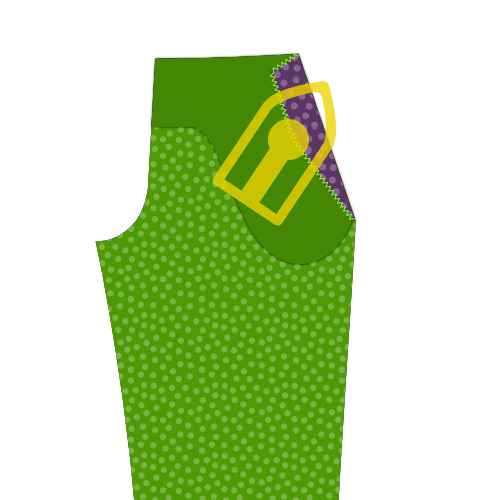

Lorsque vous avez fini, placez la pièce devant, la doublure et le fond de poche à plat, et repassez.

> C'est peut-être le bon moment de vous rappeler que chaque étape jusqu'à ce point doit être effectuée pour chaque jambe.
>
> C'est juste un pense-bête amical, les prochaines étapes seront également à répéter pour les deux jambes.

### Etape 9 : Fixer la pièce côté au fond de poche

Placez l'autre moitié de fond de poche à l'envers, et alignez la pièce côté dessus à l'endroit.

Coudre un point zig-zag le long du bord de la pièce côté pour la finir et la fixer au fond de poche.

### Etape 10 : Fermer le fond de poche

Placez la pièce devant, la doublure et le fond de poche avec le fond de poche au dessus.

Alignez le second fond de poche avec la pièce côté fixée vers le bas.

Epinglez toutes les pièces ensemble en veillant à rester vers le bord incurvé du fond de poche.

Lorsque tout est épinglé ensemble, rabattez la pièce devant et la doublure, et fermez la courbe du fond de poche.

> Cousez la courbe du fond de poche jusqu'à atteindre le point où il rejoint la pièce côté.

> Vous pouvez finir le fond de poche de nombreuses façons, incluant :
>
> - Surjeter les côtés ensembles
> - Finir le bord avec du biais
> - Coudre les côtés ensemble et finir le bord avec un point zig-zag

### Etape 11 : Repasser la poche avant

Mettez tout à plat avec la pièce devant en dessous, et donnez un bon coup de fer.

### Etape 12 : Epingler la poche devant en place

Epingler la poche sur la pièce le long de l'inclinaison et des bords du fond de poche. 
Cela empêchera de se déplacer pendant que nous continuons à travailler sur notre pantalon.

### Etape 13 : Finir les coutures des côtés

Avant de coudre les coutures des côtés, finissez les bords des côtés en surjetant ou en effectuant un point zig-zag le long de côtés de vos pièces devant et derrière, en vous assurant de rester dans la marge de couture prévue.

> Soyez sûr d'inclure la doublure et les bords des fonds de poche, étant donné que cela empêchera les choses de bouger lorsque nous allons coudre les coutures des côtés.

### Etape 14 : Coudre les coutures des côtés

Placez le devant et le derrière de chaque jambe l'un par dessus l'autre, endroit contre endroit.

Alignez la couture de côté, plus précisément la couture côté sur l'extérieur, où il n'y a pas de courbe d'entrejambe

> Vous pouvez épingler les pièces ensembles pour vous assurez que tout restera en place lorsque vous allez effectuer cette longue couture.

Effectuez la couture, en partant de la ceinture le long du côté de votre pantalon.

### Etape 15 : Ouvrir les coutures

Ouvrez les marges de couture au fer le long des coutures des côtés. Faitez le sur l'envers, et répétez sur l'endroit du tissu.

Prendez votre temps, en veillant à utiliser une température assez élevée, mais pas trop. Utilisez la vapeur ou un vaporisateur d'eau pour un meilleur effet.

> Une couture bien plate a un très bel aspect, alors prenez votre temps pour bien la repasser.

### Etape 16 : Coudre le parement de braguette et la braguette

Placez votre braguette sur le parement de braguette endroit contre endroit, et alignez le bord avec la plus grande courbe.

Cousez le long du bord courbe, en prenant en compte la marge de couture standard de 1 cm, pour assembler les deux pièces.

> Si votre doublure a un peu d'élasticité, essayez de l'étirer un peu tout en cousant la courbe. Cela sera plus facile de faire reposer la doublure bien à plat plus tard sans faire de petits plis.

### Etape 17 : Repasser le parement de braguette

> Avant de repasser votre pièce de braguette, veillez à rouler un peu la couture pour le tissu de doublure de votre pantalon soit un peu plus loin, et que la doublure commence seulement à 2 cm environ du bord. Cela empêchera la doublure de déborder à l'extérieur sur le bord.

Après avoir cousu la braguette et le parement de braguette ensemble, retournez-les sur l'envers et repassez la couture que vous venez d'effectuer.

### Etape 18 : Epingler la fermeture éclai à la pièce devant droit

> Les étapes 18 à 21 mènent à une unique rangée de point qui va fixer le zip au devant, tout en attachant la braguette et le parement d'un coup.
>
> C'est la couture la plus difficile à faire dans tout le procédé de construction, alors je prends le temps de vous l'expliquer et de l'illustrer avant que vous commenciez à coudre.

Placez votre pièce devant pour la jambe droite à l'endroit, de façon à ce que la doublure et le fond de poche avant se retrouvent en dessous et soient bien à plat.

Prenez votre fermeture éclair et ouvrez-la (dézippez-la). A présent, retournez-la pour qu'elle soit à l'envers. En d'autres termes, avec la tirette en dessous.

Alignez votre zip avec la couture d'entrejambe telle que montrée sur l'illustration. Prenez bien en compte ce qui suit :

 - La fin de votre zip devrait se trouver en haut de votre pantalon là où la ceinture commencera. Cependant, souvenez vous qu'il y a une marge de couture à cet endroit, alors n'alignez pas avec le haut de la pièce devant, mais soustrayez 1 cm de marge de couture.
 - Alignez le zip avec la couture d'entrejambe. Ne vous préoccupez pas du bord du zip, étant donné qu'ils peuvent être de largeurs différentes. Au lieu de ça, veillez à pouvoir coudre au plus près des dents du zip au sein de la marge de couture de la pièce devant.

Epinglez la fermeture en place avec quelques épingles perpendiculaires à cette dernière (comme montré). Autrement dit, n'épinglez pas au long du zip, mais sur la largeur.

> Si vous n'êtes pas sûr de comment placer votre zip, mettez-le le plus près possible du bord. Faire ainsi impliquera que votre zip est glissé un peu plus loin que la braguette, et qu'il ne sera certainement pas apparent.

### Etape 19 : Epingler le parement de braguette à la fermeture éclair

Prenez votre pièce parement de braguette/braguette que vous avez assemblée au cours des étapes 16 et 17, et placez la avec le tissu à l'envers et la doublure à l'endroit.

Rabattez sur le côté la couche de doublure du dessus, et alignez le bord légèrement courbé du tissu (là où il n'est pas cousu à la doublure) avec le bord du tissu de votre pièce devant.

> Pour plus de clarté, le côté du parement de braguette qui devraiet être à l'endroit est montré en haut de l'illustration, à une échelle plus petite.

Epinglez cette épaisseur en place avec quelques épingles perpendiculaires à votre zip (montrées en rouge). Veillez à prendre toutes les couches en dessous, en incluant le zip. De cette façon, vous pouvez retirer vos épingles de l'étape précédente (montrées en vert) lorsque c'est fait.

> Si vous êtes à l'aise pour maintenir tout cela en place, vous pouvez laisser la doublure repliée en arrière et tout épingler ensemble comme cest montré dans la prochaine étape. C'est en quelque sorte plus rapide, mais cela induit plus de risques d'erreur, comme les choses peuvent bouger plus facilement.

### Etape 20 : Epingler le parement de braguette en place le long du zip

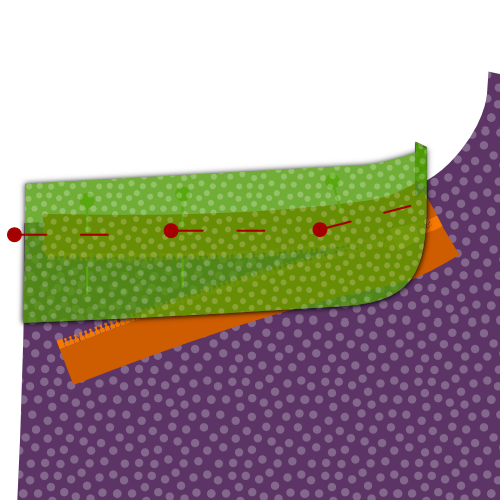

laisser la doublure repliée en place, puis épinglez toutes les couches ensembl le long du zip.

Lorsque vous avez fini, enlevez les épingles que vous avez placées précédemment de façon perpendiculaire.

### Etape 21 : Rabattre le parement de braguette et épingler

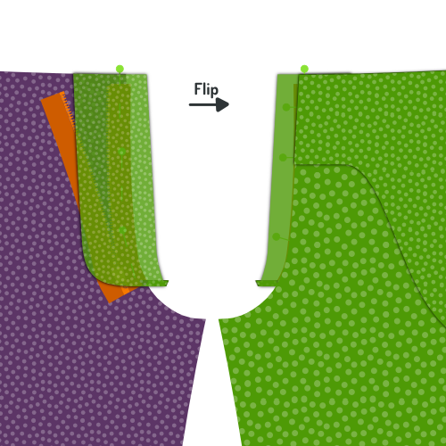{.fs-row2}
{.fs-row2}

Retournez le tout pour que le parement de braguette se retrouve en bas.

Rabattez la doublure du parement de braguette autour de la braguette, de la pièce devant et de la braguette, en vous assurant de la plier en deux pour que le bord non fini soit caché à l'intérieur.

Epinglez-cela, et retirer vos épingles précédentes.

### Etape 22 : Coudre la braguette en place le long du zip

Maintenant vous pouvez coudre le long de la braguette pliée en deux. Cela va fixer en place le devant, la fermeture éclair, le parement de braguette et la braguette.

> Vous allez coudre le long du zip, alors veillez à installer votre pied pour fermeture éclair sur votre machine, si vous en avez un.

### Etape 23 : Rabattre la braguette et repasser

Lorsque vous aveez fini, rabattez la braguette de façon à ce qu'elle s'étende à partir de la pièce devant, et donnez un coup de fer vigoureux depuis l'envers. Et un coup délicat sur l'endroit.

### Etape 24 : Appliquer du biais sur la seconde pièce de braguette et repasser

Appliquer du biais sur le bord avec la courbe large de la seconde pièce de braguette.

Repassez le bord fini lorsque vous aurez terminé.

> Utiliser du biais est une manière de finir une couture. Si vous n'êtes pas sûr de ce que c'est où comment l'appliquer, faites-le moi savoir.

### Etape 25 : Epingler et coudre la pièce de braguette à la couture d'entrejambe

Placez la jambe gauche à l'endroit. Placez la seconde pièce de braguette au dessus à l'envers, en alignant au niveau de la couture non finie d'entrejambe.

Epingler la pièce de braguette en place, puis cousez-la en place le long de la couture d'entrejambe.

> Lorsque vous cousez en place, veillez à bien prendre la doublure devant.

Repassez le bord fini lorsque vous aurez fini.

### Etape 26 : Rouler la pièce de braguette vers l'arrière, et repasser la couture

Pliez la pièce de braguette vers l'arrière. Avant de repasser, veillez à rouler la couture un peu vers l'arrière pour que le devant de votre pantalon soit un peu plus loin que la pièce de braguette.

De cette manière, la couture ou la pièce de braguette ne sera pas visible à l'avant.

Donnez un bon coup de fer depuis l'envers.

### Etape 27 : Epingler et coudre la fermeture éclair à la pièce de braguette

{.fs-row3}
{.fs-row3}
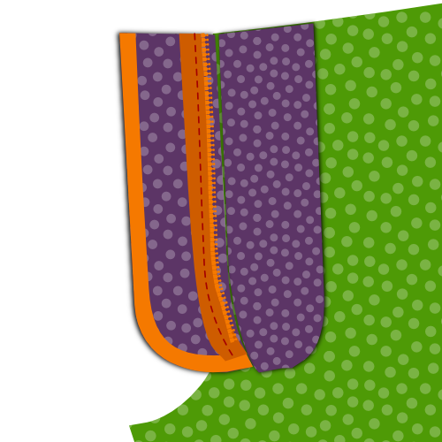{.fs-row3}

Placez la jambe droite à l'endroit puis la jambe gauche par dessus à l'envers.

Avec la couture d'entrejambe alignée, épinglez le zip à l'envers le long du bord de la pièce de braguette.
Veillez à épingler le zip seulement à la pièce de braguette, pas aux autres couches en dessous.

> Je trouve plus facile d'épingler le zip à travers toutes les couches, et puis lorqu'il est bien maintenu en place ajouter des épingles supplémentaires qui ne traversent que le zip et la braguette. Lorsque c'est fait, vous pouvez retirer les épingles qui traversent toutes les couches.

Dernier point mais non le moindre, cousez le long du zip avec votre pied pour fermeture éclair pour le fixer à la braguette.

> Lorsque vous alignez le zip, veillez à prendre en compte ce qui suit :
>
> - Le zip devrait être placé à l'envers
> - Il devrait se trouver un peu en arrière du bord de votre braguette
> - Veillez à bien aligner le haut du zip avec l'autre moitité sur la jambe droite

### Etape 28 : Faites un point zig-zag pour fixer le bord du zip avec la pièce de braguette

Avec la braguette en place, faites courir un point zig-zag le long du bord du zip pour le fixer à la pièce de braguette.

### Etape 29 : Faire un point d'arrêt sur les pièces de braguette

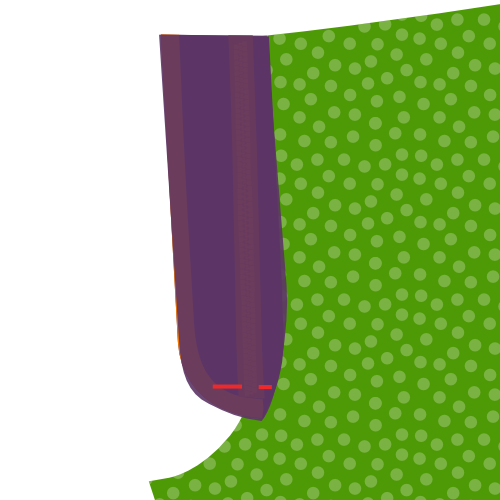

Placez les deux parties de braguettes ensemble, et écartez les pièces devant hors du chemin.

Utilisez un point d'arrêt pour les assembler en bas du zip. Cousez sur les deux bords du zip, et aussi près que possible de ce dernier que vous le pouvez.

> Si votre zip est trop long, vous pouvez le couper en dessous des points d'arrêt.

### Etape 30 : Réaliser la couture d'entrejambe

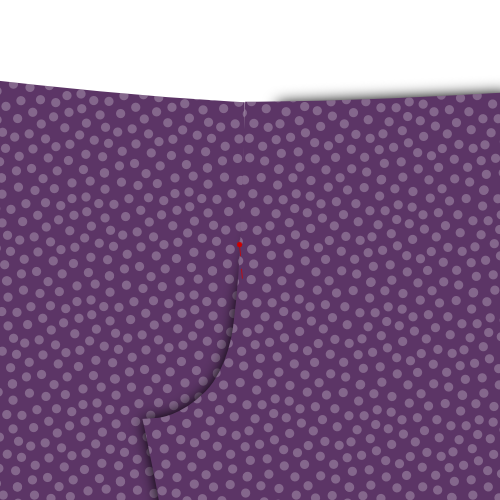{.fs-row2}
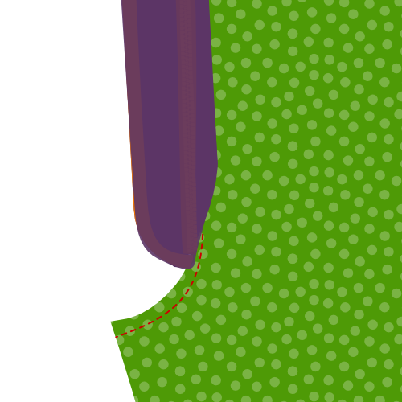{.fs-row2}

Placez les deux devants à l'endroit. Ils sont à présent assemblés par la braguette.

Assurez-vous que la braguette est repliée nettement en dessous, et épinglez les deux devants ensembles en bas de la braguette, où vous avez effectué des points d'arrêt plus tôt. Assurez-vous que l'épingle soit alignée avec le pli de votre devant.

Pliez les devants endroit contre endroit, et épinglez les ensemble le long de l'entrejambe.

Vous aurez besoin de mettre le parement de braguette hors du chemin, de façon à ce que si vous avez épinglé à travers toutes les couches plus tôt, retirez cette épingle maintenant, en vous assurant de la remplacer avec une épingle horizontale. Cela vous indiquera jusqu'où coudre.

Coudre l'entrejambe, en démarrant au point de croisement de l'entrejambe, et en allant vers le haut vers votre épingle.

> Je trouve cette étape difficile à expliquer, et à illustrer. J'espère que cela prendra son sens lorsque vous regarderez votre braguette. Sinon, jetez un oeil aux instructions vidéos.

### Etape 31 : Epingler pour fermer la braguette et bâtir la courbe de la braguette

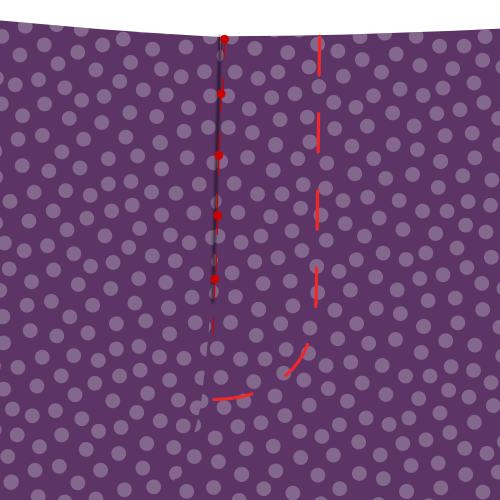

Fermez la braguette, et épinglez les devants ensemble en veillant à ce que la braguette soit nettement repliée.

Nous allons ensuite surpiquer la courbe de la braguette, et c'est une bonne idée de la bâtir d'abord.

Vous devriez démarrer un peu au-dessus de vos points d'arrêt précédants, et veiller à ne prendre que le parement de braguette de la jambe gauche.

faites une courbe vers le haut, vers le bord du parement de braguette, puis continuez parallèlement au zip.

### Step 32: Topstitch the fly curve

Now topstitch your fly curve, using your basting as a guide.

When doing so, you will be locking your front, fly piece, pocket bag and lining all together.

### Step 33: Pin together the inner leg seam

Close the legs with the good sides together, and pin together the inner leg seam. Start at the cross seam point and work your way to the bottom of the legs.

Make sure to do this for both legs.

### Step 34: Sew the inner leg seams

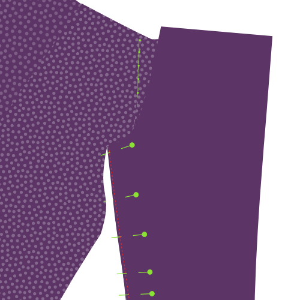

On both legs, sew the inner leg seams that you just pinned. Make sure to respect the seam allowance.

### Step 35: Press open seam allowance of the inner leg seam

Place your leg inside-out on your ironing board, and press open the seam allowance of the inner leg seam.

### Step 36: Close the cross-seam

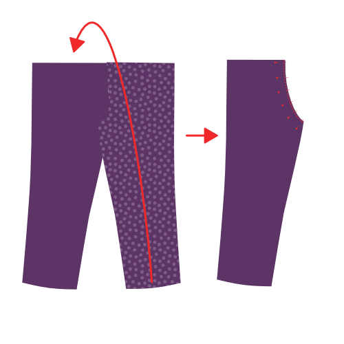

We are now going to close the cross-seam, from the bottom of your fly between your legs, up your bum to the center back of where you'll add the waistband later.

To do so, turn on of the legs inside out, so that that good side of the fabric is turned inside, and the bad side and lining sits on the outside.

The other leg should not be turned inside-out, but should just have its good side on the outside.

Now, put the leg that has the good side out (the normal leg) into the leg that has the bad side out (the inside-out leg).

This way, the good sides of both legs will sit against each other, and this is how you should sew the cross seam.

> Be careful that your leg is not twisted inside the other leg. When in doubt, turn the inside-out leg outside-out again after you've pinned the cross-seam to make sure it's all ok.

Pin the cross-seam in place, and then sew it close, starting at the side of the fly, and making sure to respect the seam allowance.

When done, press the seam allowance open.

### Step 37: Press the leg crease in place

Turn your trousers good side out, and carefully place one leg on your ironing board so that it lies flat and folds exactly on the crease line your basted earlier.

When it's looking good, press the crease lines in your leg, front a back. Repeat for the other leg.

Give it a firm press because you want the pleats to still be there after you wash your trousers (so you can see where to press them again).

>In the industry, chemicals are applied along the crease line before it is pressed together. Some tailors use some sort of wooden hammer and anvil to bang the fibers in a permanent crease.

Depending on your fabric, your crease might last longer, but ultimately, you can't expect to have a crease that can withstand a few washes without being reapplied.

> Maybe this goes without saying, but there's also another option: Do not press the crease. This give your trousers a more informal look.

### Step 38: Fuse interfacing to waistband

Fuse the waistband interfacing (Piece 3) to the waistband (Piece 4).

Align the interfacing in the middle of the waistband, and make sure to keep it nicely aligned as you fuse it in place with your iron.

### Step 39: Close waistband and waistband lining

Join the waistband (Pieces 4a and 4b) by sewing both pieces good sides together.

Join the waistband lining (Pieces 5a and 5b) by sewing both pieces good sides together.

### Step 40: Sew waistband to waistband lining

Place your waistband on the waistband lining, good sides together, so that the waistband interfacing is facing upwards.

Align the edge, and pin them together.

> We are going to sew along the edge of the interfacing, but we will sew about 3mm or 1/8 inch from the actual interfacing edge. This will prevent the lining from being visible from the front later.

On one side of the waistband, end with a curve and then go down vertically along the edge of the waistband interfacing. Check the illustration to make sure you do it on the correct side.

### Step 41: Roll fabric around interfacing edge and press waistband

Before pressing the waistband, make sure to roll over the fabric around the edge of the interfacing.

Remember that in the previous step your sewed 3mm from the interfacing edge? You need to make the fold around the edge of the interfacing so that the actual seam sits 3mm more inwards.

This will make sure that our lining fabric is never on display from the front of your trousers.

### Step 42: Pin waistband to trousers

Pin the edge of your waistband (the side you did not sew the lining to) to the top of your trousers, good sides together.

Tuck the edge of your fly into the end of the waistband with the curved corner. On the other end of the waistband, it will be longer. In other words, your waistband will overlap here.

> Be careful to match the vertical alignment of the waistband at the zip. With the zip closed, both sides of the waistband should sit at an equal height. This is easy to miss if you don't check it.

### Step 43: Sew waistband to trousers

Now that the waistband is pinned to top of your trousers, sew it in place.

On the side with the curved corner, get as close to the edge as possible. On the other side, stop when you reach the edge of your fly.

### Step 44: Press waistband

Give your newly sewn seam a good press. Do not press the seam open, instead press it towards the top (put both trousers and waistband seam allowance in the waistband).

### Step 45: Prepare the belt loops

The belt loops are a part of your trousers where you can let your creativity run free. There's load of different ways to make and shape belt loops, not to mention that where you place them is also up to you.

That being said, here's what to do to make a standard belt loop:

Find the belt loop pattern part, a small rectangular piece of fabric. There should be 8 of them, and these will become your belt loops. For each of them, take these steps:

 - Zig-zag (or serge) along the longest edges of the rectangle
 - Fold one side back along the length, and press
 - Fold the other side back, along the length, and press
 - Hand sew along the back of the belt loop so that the folded sides stay in place, but the stitches do not show at the front
 - Give it a final good press when you're done

> While the width of your belt loops is not all that important, it does matter to make sure they are all the same width.
>
> To make it easier to have a consistent width, you can fold your belt loops around a strip of cardboard, thick paper, or plastic of the desired belt loop width.
>
> This strip can also help you with the hand sewing. Keep it in your belt loop and it will prevent your needle from piercing through all layers and your thread won't show at the front.

### Step 46: Attach the belt loops: Bottom

Attach the bottom of the belt loops to your trousers. Place them about 1.5 cm below your waistband, depending on your waistband width.

Place the good side of the belt loop down on the good side of the trousers (good sides together) and secure with a bar tack or narrow zig-zag.

Then, zig zag the edge of the belt loop to the trousers.

> It is important to get the waistband lining out of the way while doing this. Make sure to attach the belt loops only to your trousers, and not to the waistband lining.

> You have 8 belt loops, so you need to distribute them around your waistband. Have a look at an existing pair if you are uncertain how to do this.
>
> Make sure to place belt hoops close to the center back, and not too close to each other at the front (for belt buckles).

### Step 47: Waistband facing

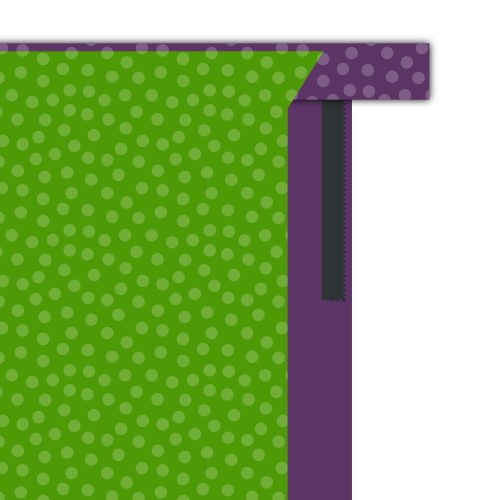

The waistband facing needs to be cut out and attached to your waistband.

This will be a lot simpler to understand if you have a look at the relevant video:

@[youtube](https://www.youtube.com/embed/8dLOuOtb18U?list=PL1gv5yv3DoZOcmOJf6f0YWi522VXXv-mM)

### Step 48: Trim waistband seam allowance

Before we finalize the waistband, we're going to trim back some of its seam allowance.

> **About seam allowance grading**
> When trimming back different layers of seam allowance, always try to cut them at different lengths so that the bulk is reduced in incremental steps.
>
> The layer that lies closest to the good side of the garment should be the longest, so trim back from there.
>
> Doing so will make it less likely that the outline of the seam allowance is visible from the good side.

### Step 49: Press and baste the waistband lining

The waistband lining will be sewn from the front of the trousers on top of the seam that joins the waistband to the trousers (so called _stitch in the ditch_).

Doing so will catch the lining and secure it in place. However, since we'll be sewing this from the good side, the lining will lie beneath all other layers, and we won't see what we're doing.

That is why, to make sure it all lies clean and flat, we will first press and baste the lining.

The lining will extend downward from the top, and it needs to be folded back up under itself, so that it will get caught by the seam when we sew it in place later.

To make sure things look pretty, the distance between the top of our waistband and the (folded back) bottom edge of our lining should be constant. You can mark an even distance from the top of your trousers, and then pin back the lining at this line. Last but not least, press that fold in your lining.

When you're happy with how it looks, baste the lining in place just next to the seam joining the waistband and trousers.

> It's best to baste next to the seam, and not actually in the seam. This will make it a lot easier to remove your basting when after we've sewn in the last step.

### Step 50: Sew the waistband lining in place

After you basted the waistband lining, sew it in place from the good side, exactly in the seam between the waistband and trousers.

### Step 51: Attach the belt loops: Top

With your waistband and lining properly secured, it's time to attach the top of the belt loops.

Sew them in place just as you did at the bottom. That is, use a bar tack or close zig-zag to attach them, then zig-zag over the end to secure it.

> Don't sew through the top of the belt loops. You'll have to work the foot of your sewing machine under the belt loop so you only sew the piece that is folded back.

> Feel free to trim back the length of your belt loops after you bar tack and before you zig-zag the end of them, as they might be too long.

### Step 52: Finish the edge of the legs

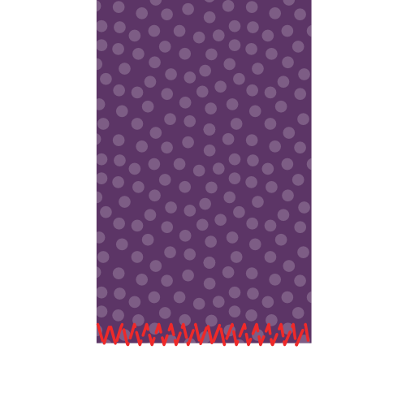

Before we hem the trousers, finish the raw edge of the legs with a zig-zag stitch or serger.

> This would also be a good time to try on your trousers and mark exactly how long you want them to be after they are hemmed.

### Step 53: (Optional) Sew in a hem ribbon

> The hem ribbon is a ribbon that sits on the inside of your trouser hem. At the place your hem folds back, the fabric has to take a lot of abuse from bumping into shoes and other things.
>
> Placing a ribbon inside the hem protects your fabric to some extent, and it is a neat finish.

Mark the hemline on your trousers (good side out).

Place the ribbon as shown in the illustration making sure that it extends a few mm above the hemline. Sew it in place all the way around the leg, making sure to sew close but not on the hemline.

### Step 54: Press the hem

Fold back the trouser legs at the hemline, and press the hem.

> If you've sewn in a hem ribbon, the ribbon will extend a few mm below the hem line, thereby protecting the fabric at the hem.

### Step 55: Hem the legs

With the hem neatly pressed, simply hand-sew the folded back part to the inside of your trousers.

> Hemming is done by hand because it's important that the stitches don't show on the front. So when hand-sewing the hem, don't push your needle through the fabric, but just catch a few threads so your stitches don't show on the front
> 
> While there are machine alternatives, they aren't as neat (blind hem stitch) or probably not accessible to the home-sewer (industrial blind hem machine).

### Step 56: Trim, clean up, and press
Trim any loose threads or basting that remains, and give your trousers a good final press.
