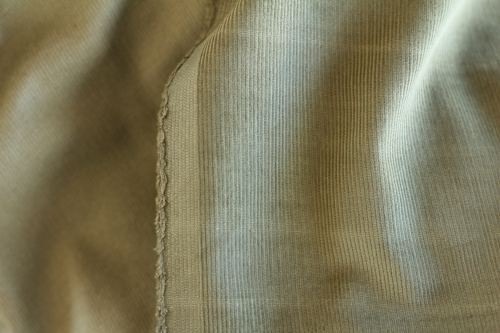

The grain of a fabric is determined by the alignment of the yarns in a woven fabric. More precisely, the grain line is determined by how the warp yarns run.

Woven fabric are produced by weaving the so-called weft between the warp threads. The warp threads run along the length of a fabric roll, parallel to the selvedge, while the weft runs back and forth across its width.

Grain is indicated on a pattern by the grain line. When cutting out your pattern, it's important to align the grain line of the pattern to the grain of your fabric.

> For more warp and weft details: [Weaving on Wikipedia](http://en.wikipedia.org/wiki/Weaving)

> ##### Confused? Think wood
> Wood is not woven, but grows in different layers based on the seasons (growth rings). 
> The way these layers are aligned are important for woodworkers. 
> They influence to what extent the wood will deform after cutting it and how it will bend, as well as other parameters.
> 
> Just like a woodworker will take this into account before cutting the wood, you should take grain into account before cutting out your fabric.
